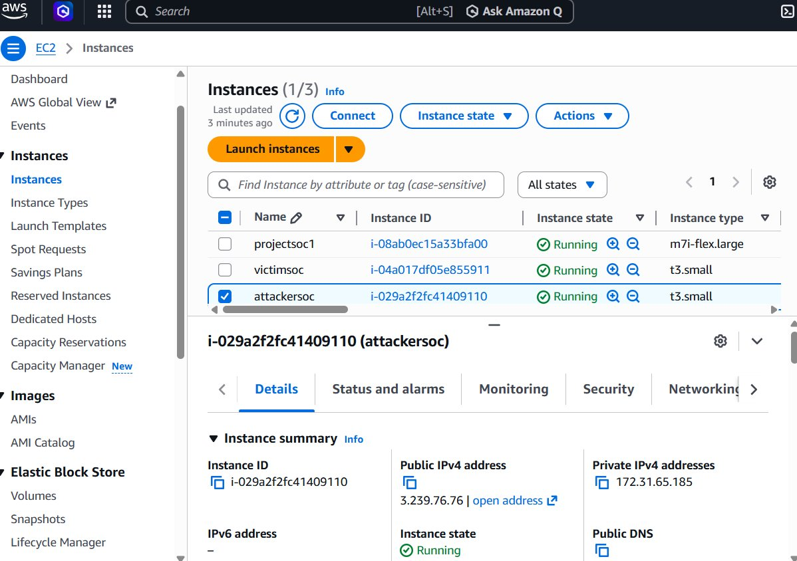
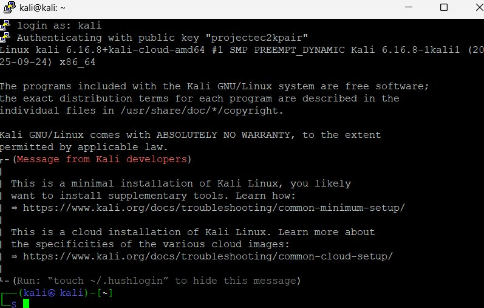
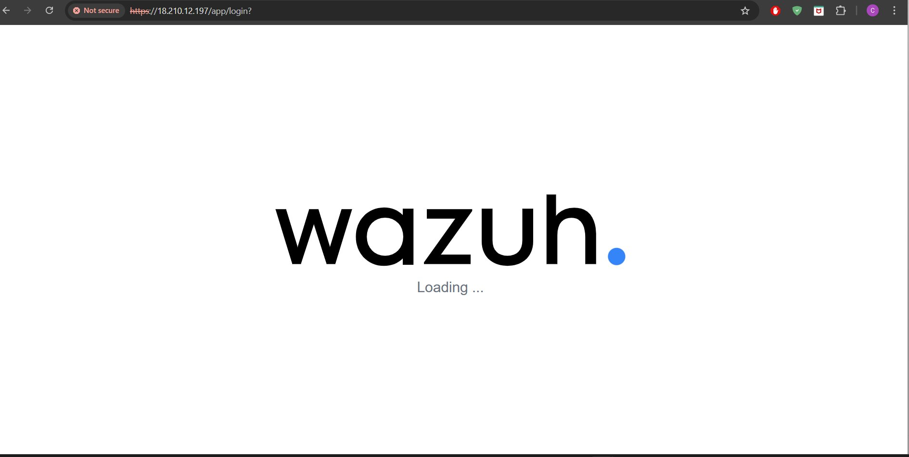
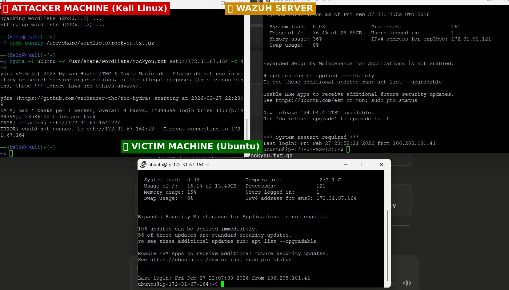
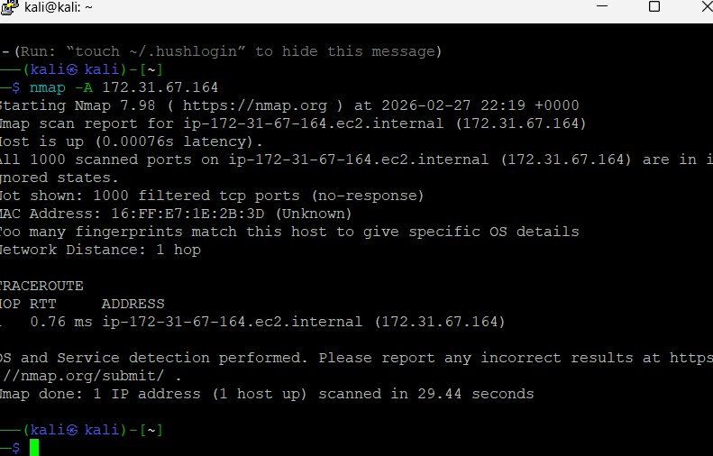
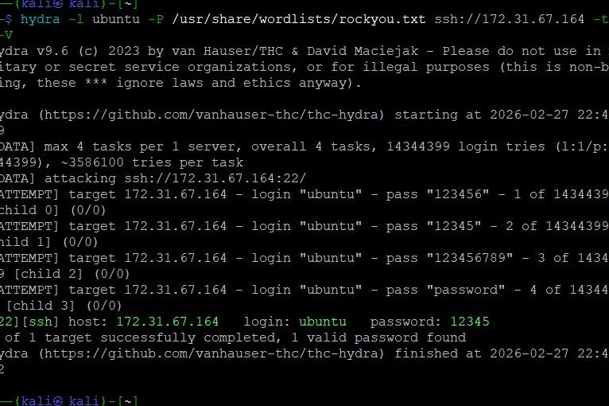
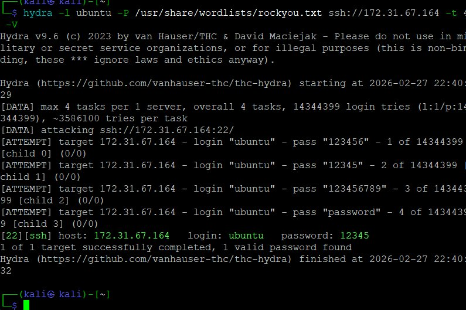
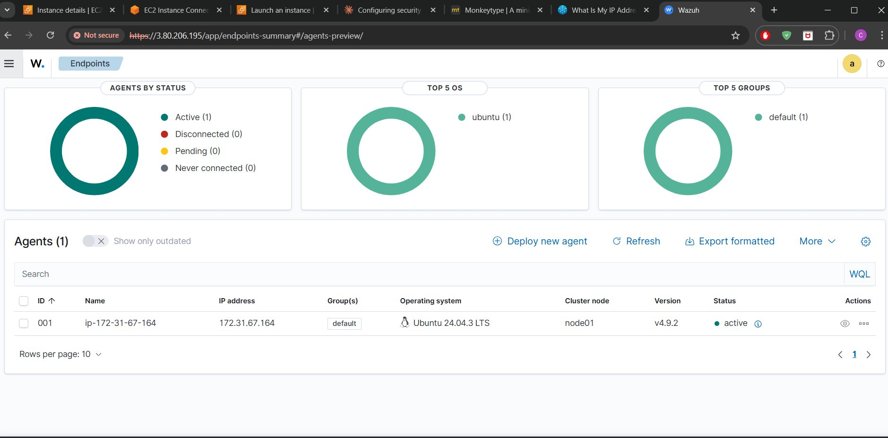
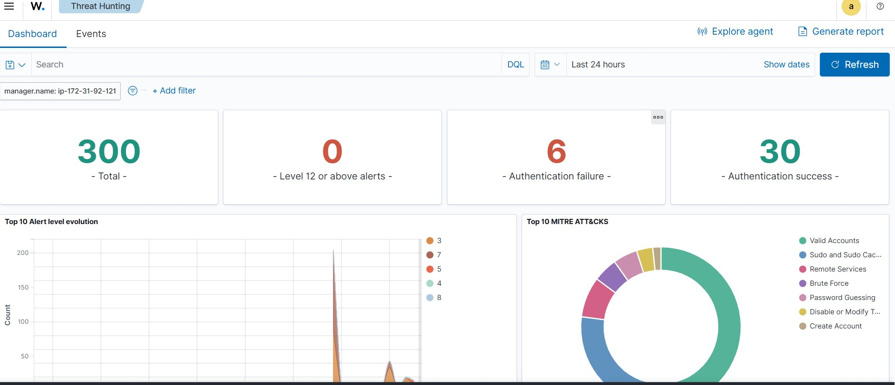
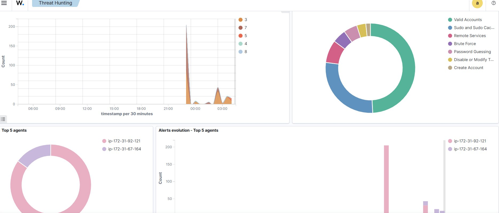

# 🛡️ Cloud-Based SOC Lab on AWS

## 📌 Project Overview
A complete **Security Operations Center (SOC)** lab built on AWS Cloud to simulate, detect, and monitor real-world cyber attacks using **Wazuh SIEM**.

This project demonstrates how a SOC team monitors threats in real time using industry-standard tools.

---

## 🏗️ Architecture
```
┌─────────────────┐         ┌─────────────────┐         ┌─────────────────┐
│   Kali Linux    │ ──────► │  Ubuntu Victim  │ ──────► │  Wazuh Server   │
│   (Attacker)    │  Attack │  (Wazuh Agent)  │  Logs   │  (SIEM/Monitor) │
└─────────────────┘         └─────────────────┘         └─────────────────┘
                                                                  │
                                                                  ▼
                                                         ┌─────────────────┐
                                                         │ Wazuh Dashboard │
                                                         │    (Alerts)     │
                                                         └─────────────────┘
```

---

## ☁️ AWS Infrastructure

| Instance | Name | Type | Purpose |
|----------|------|------|---------|
| 1 | projectsoc1 | m7i.flex.large | Wazuh SIEM Server |
| 2 | victimsoc | t3.small | Target/Victim Machine |
| 3 | attackersoc | t3.small | Kali Linux Attacker |

---

## 🛠️ Tools Used

| Tool | Version | Purpose |
|------|---------|---------|
| AWS EC2 | - | Cloud Infrastructure |
| Ubuntu | 22.04 LTS | Server & Victim OS |
| Kali Linux | 2025.4 | Attacker OS |
| Wazuh SIEM | 4.9.2 | Security Monitoring |
| Wazuh Agent | 4.9.2 | Log Forwarding |
| Nmap | 7.98 | Port Scanning |
| Hydra | 9.6 | SSH Brute Force |
| PuTTY | Latest | SSH Client |

---

## ⚔️ Attacks Performed

### 1. Nmap Port Scan
```bash
nmap -A 172.31.67.164
```
- Scanned all 1000 ports on victim machine
- Generated reconnaissance activity logs

### 2. Hydra SSH Brute Force
```bash
hydra -l ubuntu -P /usr/share/wordlists/rockyou.txt ssh://172.31.67.164 -t 4 -V
```
- Used rockyou.txt wordlist (14 million passwords)
- Successfully found password: `12345`
- Attack completed in seconds

---

## 🚨 Results — Wazuh Detection

| Detection | Status |
|-----------|--------|
| Brute Force Attack | ✅ Detected |
| Password Guessing | ✅ Detected |
| Remote Services | ✅ Detected |
| Authentication Failures | ✅ 6 Detected |
| Authentication Success | ✅ 30 Logged |
| MITRE ATT&CK Mapping | ✅ Active |

---

## 🎥 Demo Video

[](https://youtu.be/kERcBG1oRKc)

▶️ [Watch Full Demo on YouTube](https://youtu.be/kERcBG1oRKc)

---

## 📸 Screenshots

### 1. AWS EC2 — All 3 Instances Running


### 2. Kali Linux — Attacker Machine Connected


### 3. Wazuh Dashboard — Loading


### 4. All 3 PuTTY Terminals — Full Lab View


### 5. Nmap Port Scan — Attack Running


### 6. Hydra Brute Force — Attack Running


### 7. Password Found! — Attack Successful


### 8. Victim Agent — Connected to Wazuh


### 9. Wazuh Threat Hunting — Attacks Detected!


### 10. Wazuh Alerts — MITRE ATT&CK Detection


---

## 🔧 Security Group Configuration

### Wazuh Server
| Type | Port | Source |
|------|------|--------|
| All Traffic | All | My IP |
| Custom TCP | 1514 | 0.0.0.0/0 |
| Custom TCP | 1515 | 0.0.0.0/0 |
| Custom UDP | 1514 | 0.0.0.0/0 |
| HTTPS | 443 | My IP |

### Victim Machine
| Type | Port | Source |
|------|------|--------|
| All Traffic | All | 0.0.0.0/0 |

### Attacker Machine
| Type | Port | Source |
|------|------|--------|
| All Traffic | All | My IP |

---

## 📋 Step-by-Step Setup

### Step 1 — Launch EC2 Instances
- Launch Wazuh Server (m7i.flex.large, Ubuntu 22.04, 30GB)
- Launch Victim (t3.small, Ubuntu 22.04, 15GB)
- Launch Attacker (t3.small, Kali Linux 2025.4, 15GB)

### Step 2 — Install Wazuh Server
```bash
curl -sO https://packages.wazuh.com/4.9/wazuh-install.sh
sudo bash wazuh-install.sh -a -i
```

### Step 3 — Install Wazuh Agent on Victim
```bash
sudo WAZUH_MANAGER='172.31.92.121' apt install wazuh-agent=4.9.2-1 -y
sudo systemctl start wazuh-agent && sudo systemctl enable wazuh-agent
```

### Step 4 — Run Attacks from Kali
```bash
nmap -A 172.31.67.164
hydra -l ubuntu -P /usr/share/wordlists/rockyou.txt ssh://172.31.67.164 -t 4 -V
```

### Step 5 — Monitor in Wazuh Dashboard
- Open `https://WAZUH_SERVER_IP`
- Go to Threat Intelligence → Threat Hunting
- View real-time alerts and MITRE ATT&CK detections

---

## 💡 Key Learnings
- ✅ AWS Cloud infrastructure setup
- ✅ Linux server administration
- ✅ SIEM deployment and configuration
- ✅ Network security and firewall rules
- ✅ Real-world attack simulation
- ✅ Threat detection and monitoring
- ✅ MITRE ATT&CK framework
- ✅ Incident response basics

---

## 👨‍💻 Skills Demonstrated

`AWS` `EC2` `VPC` `Security Groups` `Ubuntu` `Kali Linux` `Wazuh SIEM` `Nmap` `Hydra` `SSH` `Linux Administration` `Threat Detection` `MITRE ATT&CK` `SOC Operations`

---

## 📝 License
This project is for educational purposes only. Do not use these techniques on systems you don't own.
